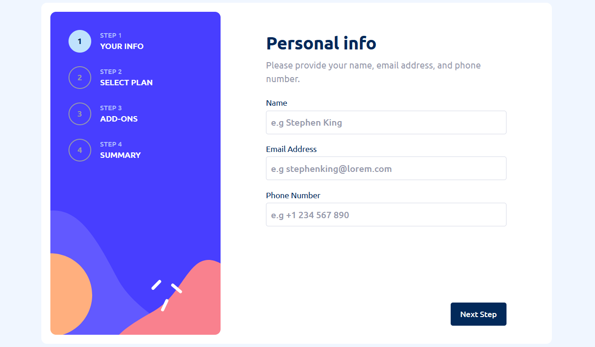

# Frontend Mentor - Multi-step form

This project is a multi-step form challenge from Frontend Mentor, built as a single-page application (SPA) using web components and custom routing. The form takes users through multiple steps and provides a seamless experience, updating the page without a full reload.



## Key Features

-   **Web Components:** Uses custom HTML elements and template-driven design.
-   **Custom Router:** A minimal client-side router to handle navigation between steps.

# Running locally

1. clone repository

```bash
    git clone https://github.com/Raphico/multi-step-form.github.io.git
```

2. run app with live server
